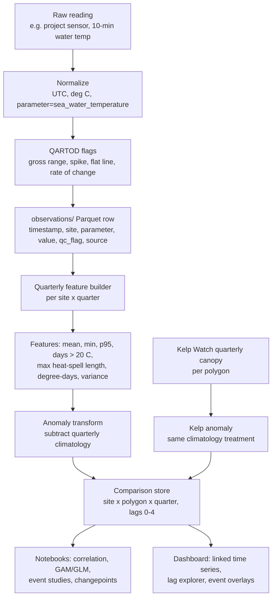

# 01 — System Architecture

**Status:** Draft for review
**Audience:** Research team members evaluating the design; future maintainers.

## 1. Context and goals

Kelp Watch publishes quarterly kelp canopy area/biomass derived from Landsat
at 30 m resolution (Q1 Jan–Mar, Q2 Apr–Jun, Q3 Jul–Sep, Q4 Oct–Dec). The
project has placed its own environmental sensors (temperature now, more types
later) that are not part of the NOAA or SCCOOS networks. The goal is to
determine whether and how these independent sensors capture environmental
signals that explain kelp forest change, using public data (NDBC, NOAA
CO-OPS, SCCOOS ERDDAP, CDIP, CDFW) both as additional predictors and as
validation references for the project sensors.

The system must therefore do three things well: (a) ingest heterogeneous
sources into one comparable form, (b) reconcile a fundamental timescale
mismatch — quarterly kelp observations versus minute-to-hour sensor
observations — through ecologically meaningful aggregation, and (c) present
results in a way one researcher can explore locally and export for the team.

### Non-goals (for this phase)

Multi-user access, cloud deployment, real-time alerting, and automated
report generation are explicitly out of scope. The design should not
*preclude* them (see §6), but no component exists to serve them.

## 2. Constraints and requirements

**Functional.** Ingest all cataloged sources on demand; validate project
sensor data with published QC tests; compute quarterly features aligned to
the Kelp Watch calendar; support lagged comparison of kelp vs. environment
per site and per kelp polygon; render an interactive local dashboard;
regenerate everything from raw data with one command.

**Non-functional.** Single local machine (no always-on services); data
volume is small by modern standards — decades of quarterly kelp values plus
a handful of high-frequency stations lands in the low gigabytes, so
everything fits on disk and in single-machine memory with columnar formats;
one operator, so operational simplicity beats scalability; all outputs
(docs, notebooks, dashboard exports) must be shareable with a small research
team; reproducibility matters because results may feed publications.

## 3. High-level design

Three layers, one direction of flow. Raw data is immutable once landed;
every derived layer can be deleted and rebuilt.

```mermaid
flowchart LR
    subgraph EXT[External sources]
        KW[Kelp Watch<br/>quarterly CSV export]
        NDBC[NDBC<br/>realtime + stdmet files]
        COOPS[NOAA CO-OPS<br/>REST API]
        ERD[SCCOOS / CalOOS<br/>ERDDAP]
        CDIP[CDIP waves<br/>THREDDS/ERDDAP]
        CDFW[CDFW / marineBIOS<br/>GIS layers]
        OWN[Project sensors<br/>local files]
    end

    subgraph L1[Layer 1 — Ingestion]
        F[Per-source fetchers] --> N[Normalizer<br/>common schema, UTC, SI units]
        N --> Q[QA/QC<br/>QARTOD tests]
    end

    subgraph L2[Layer 2 — Storage and aggregation]
        RAW[(raw/ Parquet<br/>immutable landings)]
        OBS[(observations/<br/>partitioned Parquet)]
        FEAT[(features/<br/>quarterly features)]
        DUCK[DuckDB<br/>query engine]
    end

    subgraph L3[Layer 3 — Analysis and presentation]
        NB[Jupyter notebooks<br/>versioned analyses]
        DASH[Streamlit dashboard<br/>local, on demand]
        EXP[Exports<br/>figures, CSVs, reports]
    end

    EXT --> F
    Q --> RAW
    RAW --> OBS
    OBS --> FEAT
    OBS --- DUCK
    FEAT --- DUCK
    DUCK --> NB
    DUCK --> DASH
    NB --> EXP
    DASH --> EXP
```

### Layer 1 — Ingestion

One fetcher module per source, each implementing the same interface:
`fetch(site, start, end) -> raw payload` and `parse(payload) -> DataFrame`
in the common observation schema (doc 03). Fetchers are the *only* code that
knows source-specific formats, units, and quirks (doc 02). The normalizer
enforces UTC timestamps, SI units, and controlled parameter names. The QA/QC
stage attaches QARTOD-style flags without ever dropping rows — flagged data
is retained and filtered at query time, so QC decisions are reversible.

### Layer 2 — Storage and aggregation

Parquet files on local disk, organized as a small lakehouse: an immutable
`raw/` zone (exact landings, for reproducibility and re-parsing), an
`observations/` zone (clean, normalized, partitioned by source and year),
and a `features/` zone (quarterly aggregates). DuckDB queries the Parquet
directly — there is no database server, and the DuckDB file itself is
disposable. Kelp geometries and site locations live as GeoJSON handled by
geopandas. Rationale and alternatives in ADR-001.

### Layer 3 — Analysis and presentation

Notebooks own the science (feature exploration, lagged correlation, models —
doc 04) and are versioned in git alongside the package. The Streamlit
dashboard owns interactive exploration: a site map, linked kelp/environment
time series, anomaly views, and event overlays. It is launched on demand
(`streamlit run app.py`) and reads only from Layer 2 through DuckDB — it
performs no ingestion and no statistics of record, so a dashboard bug can
never contaminate an analysis result.

## 4. Data flow: from a sensor reading to a comparison

Two details in this flow carry most of the scientific weight. First, the
feature builder computes distribution-aware features, not just means —
kelp responds to extremes (sustained heat, the coldest upwelling water)
that a quarterly mean erases. Second, both kelp and environment are
converted to anomalies against their own quarterly climatologies before
comparison, so the dominant seasonal cycle does not masquerade as a
relationship.

## 5. Operational model

There is no daemon. A single CLI (`kelpcompare ingest`, `kelpcompare qc`,
`kelpcompare features`, `kelpcompare rebuild`) runs the pipeline; the
operator runs it manually or wires the same commands into cron/launchd if
routine refresh becomes tedious (ADR-002). Each run writes a manifest
(what was fetched, when, row counts, QC flag summary) so any dataset state
can be traced to the runs that produced it. Public-source outages are
tolerated: fetchers retry politely, then record the gap in the manifest and
move on — a missing NDBC month must never block a Kelp Watch update.

## 6. What we'd revisit as the project grows

The choices below are correct for one researcher on one machine and are the
first things to change if the situation changes. If the team needs shared
querying, the Parquet zones move unchanged to object storage (S3/GCS) and
DuckDB is swapped or supplemented with a hosted engine — the schema and
feature definitions survive intact. If sensors multiply into a true network,
ingestion moves from pull-on-demand to scheduled jobs with alerting. If
stakeholders need the dashboard, Streamlit deploys to a small server behind
auth largely as-is. None of these require rewriting the science layer, which
is the point of keeping it in notebooks against a stable schema.

## 7. Risks

The main technical risk is silent unit or datum inconsistency across sources
(doc 02 mitigates with per-source contracts and validation-against-neighbor
checks). The main scientific risk is overinterpreting a short quarterly
series with autocorrelated errors; doc 04 constrains the methods
accordingly. The main operational risk is upstream format drift (NDBC file
layouts, ERDDAP dataset renames); isolating all format knowledge in fetchers
limits the blast radius to one module per source.
