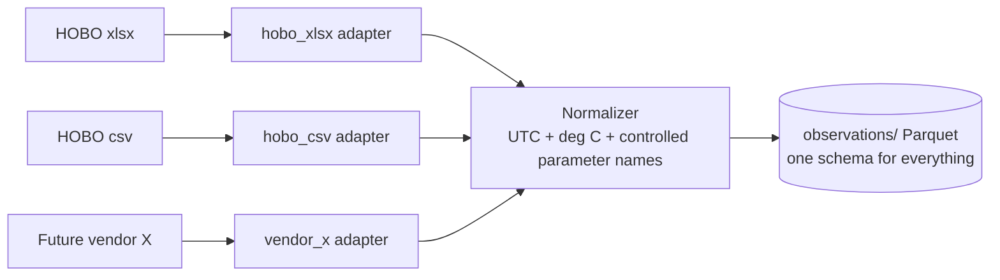

# 06 — Project Sensor Ingest Spec: HOBO Exports and the Vendor Adapter Pattern

**Status:** Draft for review
**Companion to:** doc 02 (Project sensors entry), doc 03 (observation schema)
**Reference files reviewed:** `Tidbit_1__22506632__2026-08-01_07_44_27_PDT__Data_PDT_.xlsx`
(original HOBOconnect export) and `yellow_buoy_temps.xlsx` (hand-edited copy).

## 1. What a HOBOconnect export actually contains

The reviewed files come from an Onset HOBO TidbiT MX2204 read out through the
HOBOconnect app (v2.11.0). The workbook has three sheets, and two of them are
easy to overlook:

**`Data`** — the measurements. Columns: `#` (row counter),
`Date-Time (PDT)` (local time; the timezone lives *in the header text*), and
`Tidbit 1 , °F` (the series column; the *sensor name and unit both live in
the header text*). The reviewed deployment logged every 10 minutes,
2026-07-11 07:00 → 2026-08-01 07:40, 3,029 samples, no gaps.

**`Events`** — the deployment lifecycle: `Host Connected` (configuration on
2026-07-10 15:26, plus two in-field connections), `Started` (logging began
2026-07-11 07:00), `End of File` (readout 2026-08-01 07:40). This is
machine-readable evidence of when the instrument was configured, started,
and recovered.

**`Details`** — device and deployment metadata: product (MX2204), serial
(22506632), firmware, logging interval, deployment number (3), configured
start time, and — critically — **series statistics** (n=3029, min=58.60,
max=75.35, avg=70.84 °F) computed by the app at export time.

The filename itself encodes `{name}__{serial}__{readout-datetime}`.

## 2. What the hand-edited file revealed

`yellow_buoy_temps.xlsx` is the same export with installation rows removed
by hand. Reviewing the diff surfaced exactly the hazards the pipeline must
tolerate — and one it must refuse:

Rows were trimmed at *both* ends (6 installation readings at the start,
1 retrieval reading at the end — the file ends 07:30, not 07:40). A helper
column was added containing `=min(C:C)` / `=max(C:C)` formulas, which pandas
reads as an unnamed fourth column with two orphan rows. The `#` column
silently became float. And the `Details` sheet still reports the *original*
statistics (n=3029, min=58.60), now inconsistent with the edited `Data`
sheet.

That last point is the important one: the installation transient contained a
58.6 °F reading (sensor in air/splash during install), so the export's own
min statistic is contaminated, and after hand-editing, the file's metadata
disagrees with its data. Hand-edited files are therefore ambiguous by
construction.

## 3. Policy: ingest originals; trim by registry, not by editor

**The pipeline ingests only original, unmodified vendor exports.**
Installation and retrieval periods are excluded by declaring a
**deployment window** in the site registry (doc 03, `deployments[]`), not
by deleting rows in Excel:

```json
{
  "site_id": "PROJ:TIDBIT-1",
  "deployments": [{
    "instrument": "HOBO TidbiT MX2204",
    "serial": "22506632",
    "deployment_number": 3,
    "window_local": ["2026-07-11 08:00", "2026-08-01 07:30"],
    "tz": "America/Los_Angeles",
    "series_map": {"Tidbit 1": "sea_water_temperature"},
    "depth_m": 8.23
  }]
}
```

Verified against the reviewed files: applying that window to the original
export reproduces the hand-edited file row-for-row (3,022 identical rows),
while keeping the excluded readings on record (install: 69.8, 71.0, 71.9,
68.0, 58.6, 69.0 °F; retrieval: 74.9 °F) and correcting the deployment
minimum from 58.60 °F to 63.96 °F. The trim decision becomes reviewable
metadata instead of an untracked edit — and remains reversible, consistent
with the flags-not-deletions QC policy (ADR-004).

**"Excluded" means flagged, not deleted.** Every parsed row reaches
`observations`; the seven out-of-window readings carry `qc_flag = 4` and
`qc_tests = deployment_window:fail`, and the default `qc_flag <= 2` analysis
filter drops them. This is the same rule the rest of QC follows (doc 04 §1)
and it is what makes the window reversible in practice: a corrected window
is a registry edit and a `kelpcompare rebuild`, not a re-ingest, and the
install transient stays inspectable — it is evidence about the deployment,
not noise. In-window rows land at `qc_flag = 2` (not evaluated) until
`kelpcompare qc` runs the QARTOD tests; a row whose value is absent lands at
9 (missing).

Edited files like `yellow_buoy_temps.xlsx` are still *accepted* when that's
all we have (the parser tolerates extra columns, formula rows, and blank
counter cells), but the manifest records them as `provenance: edited`, and
the validation checks in §5 that depend on internal consistency are skipped
with a warning. When both exist, the original wins.

## 4. The vendor adapter pattern (how this avoids format lock-in)

Nothing downstream of ingestion ever sees a HOBO file. The requirement
"work with this format without revolving around it" is met structurally:



Each adapter implements the same three functions:
`sniff(path) -> bool` (can I parse this file?),
`parse(path) -> RawSeries` (measurements + whatever metadata the format
carries), and `metadata(path) -> dict` (serial, model, interval, events,
export statistics). The normalizer — shared, vendor-agnostic — converts
local time to UTC using the registry timezone, converts units to SI
(°F → °C here; the unit is *read from the column header*, never assumed,
because HOBO software can be configured to export °C), maps the series to
the controlled parameter `sea_water_temperature`, joins the registry
deployment window and depth, and emits doc-03 observation rows. Adding a
new logger brand later means writing one adapter file; the schema, QC,
features, and analysis are untouched.

Format facts the `hobo_xlsx` adapter must encode, all observed in the
reference files: sheet names `Data`/`Events`/`Details`; timezone parsed
from the `Date-Time (…)` header token; sensor name and unit parsed from
the series header (`{name} , {unit}`); serial available redundantly in
filename, `Details`, and the deployment name; tolerate extra/unnamed
columns and non-numeric or missing `#` values; treat only rows with a
valid datetime as measurements.

## 5. Validation checks at ingest (per file)

Run automatically; results go in the run manifest.

1. **Statistics cross-check** (originals only): parsed n/min/max/mean must
   match the `Details` series statistics exactly. Catches truncated or
   corrupted exports — and detects hand-editing, since edits break the
   match (as the yellow file demonstrates).
2. **Events consistency**: first sample time == `Started` event; last
   sample == `End of File`; configured logging interval == observed
   timestamp spacing (10 min here, zero deviations in the reviewed file).
3. **Cadence audit**: report any gaps or irregular spacing (clock-drift
   symptom flagged in doc 02).
4. **Registry gate**: a matching serial + deployment record with timezone,
   in-water window, and series map must exist, or the file is quarantined
   rather than ingested. The series map (doc 03, `deployments[]`) names the
   controlled parameter behind each vendor series — `{"Tidbit 1":
   "sea_water_temperature"}` — because the sensor name is a user setting and
   the unit cannot stand in for it (`°C` is equally water and air
   temperature). The gate deliberately does *not* require a position — a logger
   can be recording before anyone has surveyed where it is. Both project sites
   were surveyed on 2026-08-27, so no committed record exercises that path any
   more; `tests/test_adapters_hobo_xlsx.py` writes an unplaced site of its own
   rather than letting the invariant lapse.
5. **Duplicate-readout detection**: same serial + overlapping time range as
   a prior ingest → keep both raw, dedupe deterministically in
   observations (readouts of a running logger overlap by design).
6. **QC and neighbor validation** then proceed per doc 04 §1 (the QARTOD
   gross-range test would independently have flagged nothing in-window
   here; the install transient is already flagged by the window, and would
   also show as a spike/rate-of-change failure — two independent tests
   catching the same reading, which is the intended redundancy).

## 6. Known hazards to test explicitly

**DST spanning deployments.** The header says PDT, and this deployment sits
entirely inside PDT — but a deployment crossing early November will involve
a PST transition, and how HOBOconnect labels/adjusts timestamps across it
must be verified with a real file before trusting any winter deployment.
Until verified, the adapter treats the header token as the export's fixed
UTC offset and cross-checks against the registry timezone, warning on
mismatch.

**Configurable units and names.** °F vs °C and the series name
("Tidbit 1") are user settings; a teammate's export may differ. The adapter
parses both from headers and the registry maps serial → site, so renames
don't break joins.

**Multi-series loggers.** Other HOBO models export multiple series columns
(e.g., temperature + light). The adapter should iterate all series columns
matching the `{name} , {unit}` pattern rather than assuming one.

**CSV exports.** HOBOconnect can export CSV as well as xlsx; same logical
content, different container. `hobo_csv` shares the parsing logic with a
different loader — worth building at the same time so collaborators aren't
forced into xlsx.

## 7. Team workflow (the ask of whoever handles instruments)

Send the **original, unrenamed export file** (xlsx or csv) plus three facts
per deployment: where it was (position/depth), when it was truly in the
water (in/out timestamps to the nearest few minutes), and anything unusual
(fouling, repositioning, clock resets). Do not delete rows, add columns, or
recompute statistics in the file — the pipeline does that reproducibly, and
the untouched file is what makes the record defensible later.
